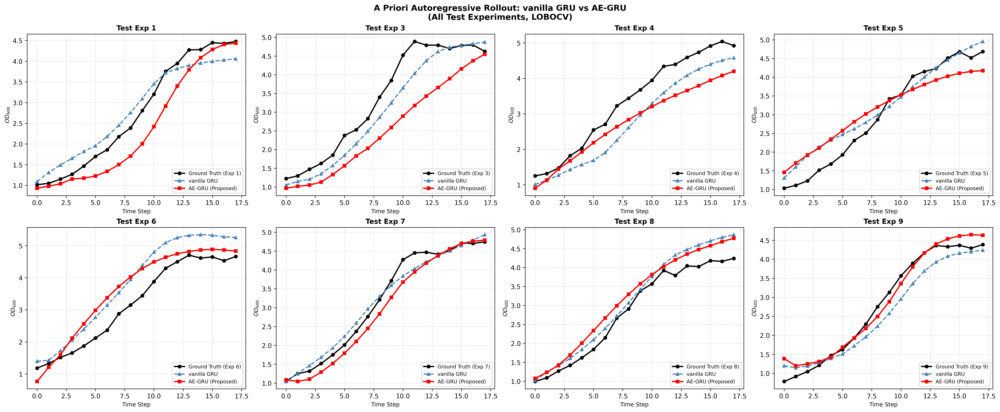
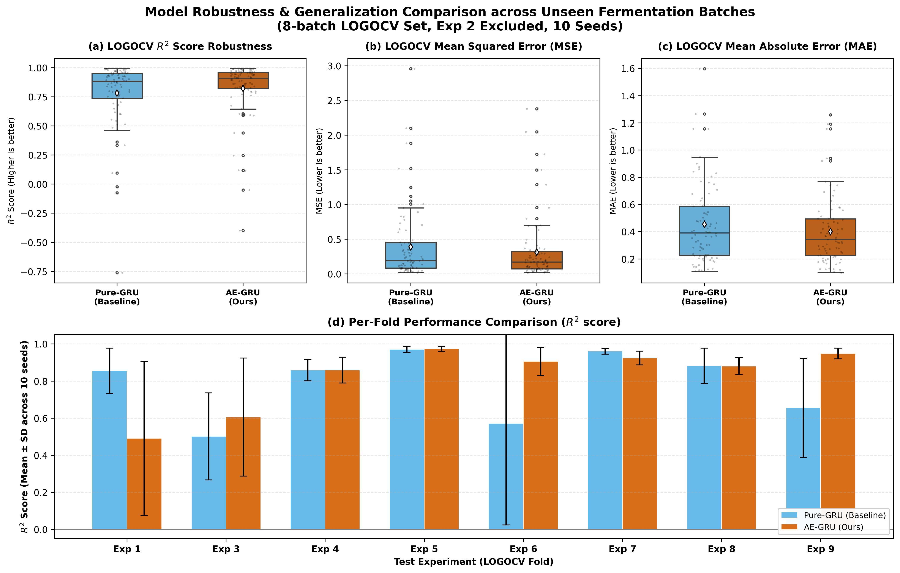
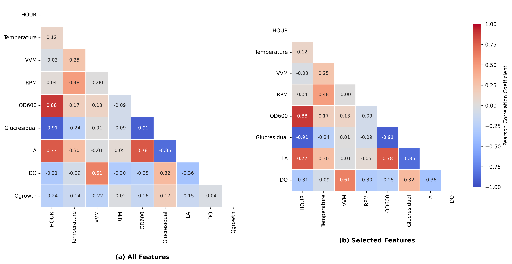

# 🔬 BEST31: Models Framework for Fermentation Process Prediction

This repository contains the official implementation for our research paper. It features a rigorous evaluation framework for bio-process time-series prediction using Recurrent Neural Networks (RNN) and Autoencoders.

---

## 🌟 Research Highlights
* **Rigorous Validation:** Implements **Leave-One-Bio-Group-Out Cross Validation (LOBOCV)** across N_exp independent fermentation experiments (`ExpID`) to guarantee out-of-batch generalization.
* **Robustness & Reproducibility:** Evaluated across **10 different random seeds** to ensure statistical significance.
* **Transfer Learning Architecture:** Features pre-trained **Autoencoders (AE)** integrated with **GRU/LSTM** networks, benchmarked against pure recurrent baselines.

---

## 📊 Key Results & Empirical Evaluation

*Below are the core findings and model evaluation plots referenced in our poster/paper. All figures can be found in the `images/` directory.*

### 1. Dynamic Rollout Predictions
The figure below demonstrates the long-term forecasting capability of our proposed framework against the actual fermentation trajectories across key variables (e.g., \(OD_{600}\), metabolites).

* **Key Takeaway:** The proposed hybrid model tracks the non-linear growth phases and metabolic shifts with high fidelity, preventing error accumulation over extended prediction horizons.*

### 2. LOBOCV Performance Comparison & Seed Robustness
This plot benchmarks the 4 architectures (`AE-GRU`, `AE-LSTM`, `Pure GRU`, `Pure LSTM`) under strict **Leave-One-Bio-Group-Out Cross Validation** across 10 random seeds.

* **Key Takeaway:** Integrating a pre-trained Autoencoder significantly reduces out-of-batch variance, outperforming standard recurrent baselines in both \(R^2\) score and statistical stability (\(p < 0.05\)).*

### 3. Feature Feature Inter-correlation
The heat map below presents the **Pearson correlation coefficients** among experimental features, providing a biological and statistical foundation for our model's feature selection.

* **Key Takeaway:** High multicollinearity between time-dependent variables underscores the necessity of the Autoencoder dimension reduction phase before temporal sequence learning.*

---

## 🔒 Data Privacy & Synthetic Dataset
To protect proprietary research data and maintain confidentiality prior to official publication, the source experimental datasets are **not publicly disclosed**. 

Instead, we provide a **synthetic dummy dataset** (`LAB_train2025_sample.csv`) in this repository. This dataset contains randomized variables with identical feature dimensions (`ExpID`, `HOUR`, `OD600`, etc.). It is provided **strictly for reviewers and scholars to verify the execution of the computational pipeline** and environment setup.

---

## 📁 Repository Structure
```text
conference2026/
├── images/                                     # Figures and charts for presentation
│   ├── Combined_LOBOCV_and_Robustness_TwoModels.png
│   ├── Pearson_correlation.png
│   └── Rollout_All.png
├── .gitignore                                  # Git ignore configurations
├── four_models_lobocv.py                      # Main execution script (Architectures & LOBOCV loop)
├── LAB_train2025_sample.csv                    # Synthetic dummy dataset for pipeline verification
└── README.md                                   # Project documentation and results preview
```

---

## ⚙️ Environment Setup

Ensure you have Python 3.8+ installed. Install the required dependencies via `pip`:

```bash
pip install tensorflow numpy pandas scikit-learn
```

---

## 🚀 How to Reproduce My Results

### 1. Quick Verification (Highly Recommended for Reviewers)
The full experiment (N_exp experiments × N_seed seeds × 4 models) involves **360 training runs in my study** and may take hours. To quickly verify the pipeline functionality on the sample data, run with reduced epochs:

```bash
python four_models_lobocv.py --data LAB_train2025_sample.csv --ae-epochs 5 --gru-epochs 5 --output quick_test_results.csv
```

### 2. Full Reproduction
To execute the complete benchmarking suite matching the paper's settings:

```bash
python four_models_lobocv.py --data LAB_train2025_sample.csv
```

---

## 📦 Expected Outputs
Upon completion, the script automatically exports `results_four_models.csv` and prints two summary tables to the terminal:
1. **Overall Performance:** Mean, standard deviation, min, and max of $R^2$ scores across all seeds and groups for each model type (`AE-GRU`, `AE-LSTM`, `GRU`, `LSTM`).
2. **Detailed Breakdown:** Cross-tabulated mean $R^2$ performance per `test_exp` block.
